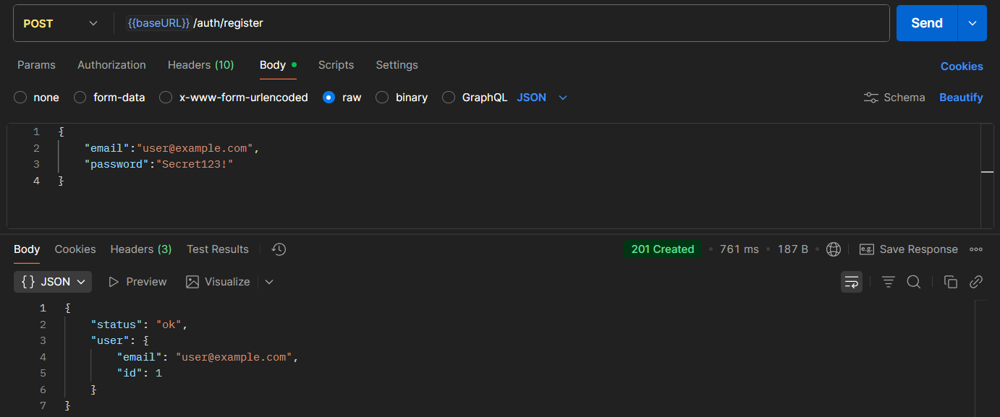
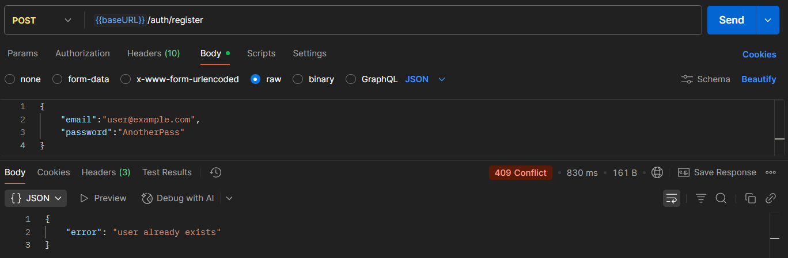
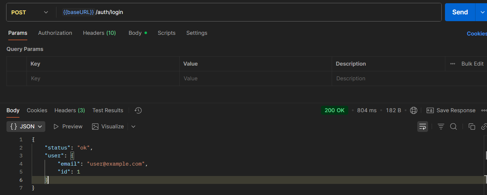
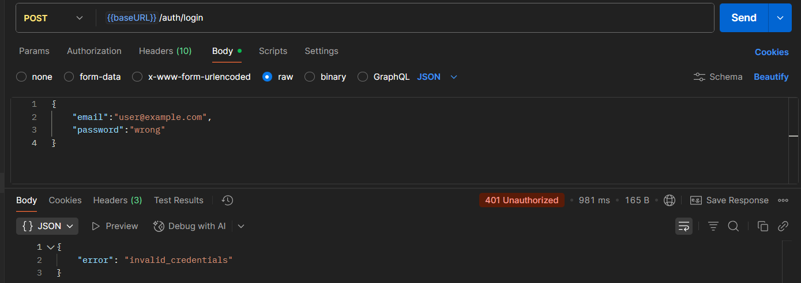

# Практическое занятие №9: Реализация регистрации и входа пользователей
## Выполнил Туев Д. ЭФМО-01-25
## Описание проекта

Данный проект представляет собой минимальный сервис аутентификации на Go, реализующий безопасное хранение паролей с использованием bcrypt. Сервис обеспечивает функциональность регистрации пользователя и входа с проверкой учетных данных.

**Основные компоненты:**
- POST /auth/register — регистрация нового пользователя с хешированием пароля
- POST /auth/login — проверка учетных данных и вход в систему
- PostgreSQL как хранилище данных с использованием GORM
- bcrypt для безопасного хеширования паролей с cost=13

## Структура проекта

```
pz9-auth/
├── cmd/
│   └── api/
│       └── main.go              # Точка входа, конфигурация маршрутов
├── internal/
│   ├── core/
│   │   └── user.go              # Модель User
│   ├── http/
│   │   └── handlers/
│   │       └── auth.go          # Обработчики Register и Login
│   ├── platform/
│   │   └── config/
│   │       └── config.go        # Загрузка конфигурации из переменных окружения
│   └── repo/
│       ├── postgres.go          # Подключение к PostgreSQL через GORM
│       └── user_repo.go         # Операции с пользователями в БД
├── .env                         # Переменные окружения
├── go.mod                       # Зависимости проекта
└── go.sum                       # Контрольные суммы зависимостей
```

## Теоретические основы

### Проблема хранения паролей

Хранение паролей в открытом виде в базе данных представляет критическую уязвимость:
- При утечке БД злоумышленник получает доступ ко всем аккаунтам
- Пользователи часто используют один пароль на разных сервисах
- Это нарушает базовые принципы безопасности

### Хеширование vs. Шифрование

**Шифрование** — обратимый процесс с использованием ключа (можно расшифровать).
**Хеширование** — необратимое преобразование (невозможно получить пароль обратно).

Для хранения паролей используется именно **хеширование**.

### Соль и защита от атак

Соль — это случайная строка, добавляемая к паролю перед хешированием. Она защищает от:
- Rainbow table attacks (атак с использованием предвычисленных таблиц)
- Выявления одинаковых паролей у разных пользователей

bcrypt встраивает соль автоматически в итоговый хеш.

### Почему bcrypt?

Неподходящие алгоритмы:
- MD5, SHA-1, SHA-256 — слишком быстрые для проверки паролей (позволяют перебор миллионов вариантов в секунду)
- Отсутствует встроенная соль

bcrypt обладает преимуществами:
- Встроенная соль
- Намеренно медленный алгоритм
- Параметр cost позволяет регулировать сложность вычисления
- Стандарт безопасности для хранения паролей

### Как работает bcrypt

bcrypt использует адаптированный алгоритм Blowfish и возвращает строку вида:

```
$2a$13$zFQ6F7hVf.../Q5qz3gGBjKW3.k2oj9fQmC8ZSkOKfN9hVZlh2
```

где:
- `$2a$` — версия алгоритма
- `13` — значение cost (параметр, управляющий сложностью)
- остальная часть содержит соль и сам хеш

При проверке пароля система извлекает соль и cost из сохраненного хеша, и хеширует введенный пароль теми же параметрами.

## Результаты тестирования

### Успешная регистрация



Результат: статус 201 Created, пользователь добавлен в БД.

### Повторная попытка регистрации с существующим email



Результат: статус 409 Conflict, email уже зарегистрирован.

### Успешный вход



Результат: статус 200 OK, пользователь успешно аутентифицирован.

### Неверные учетные данные



Результат: статус 401 Unauthorized, защита от раскрытия информации (обобщенное сообщение об ошибке).

## Ключевые фрагменты кода

### Хеширование пароля при регистрации

```go
hash, err := bcrypt.GenerateFromPassword([]byte(in.Password), h.BcryptCost)
if err != nil {
    writeErr(w, http.StatusInternalServerError, "hash_failed")
    return
}

u := core.User{Email: in.Email, PasswordHash: string(hash)}
if err := h.Users.Create(r.Context(), &u); err != nil {
    if errors.Is(err, repo.ErrEmailTaken) {
        writeErr(w, http.StatusConflict, "user already exists")
        return
    }
    writeErr(w, http.StatusInternalServerError, "db_error")
    return
}
```

### Проверка пароля при входе

```go
u, err := h.Users.ByEmail(context.Background(), in.Email)
if err != nil {
    // Не раскрываем, что именно не так
    writeErr(w, http.StatusUnauthorized, "invalid_credentials")
    return
}

if bcrypt.CompareHashAndPassword([]byte(u.PasswordHash), []byte(in.Password)) != nil {
    writeErr(w, http.StatusUnauthorized, "invalid_credentials")
    return
}
```

### Модель пользователя

```go
type User struct {
    ID           int64     `gorm:"primaryKey" json:"id"`
    Email        string    `gorm:"uniqueIndex;size:255;not null" json:"email"`
    PasswordHash string    `gorm:"size:255;not null" json:"-"`
    CreatedAt    time.Time `json:"createdAt"`
    UpdatedAt    time.Time `json:"updatedAt"`
}
```

### Обработчики регистрации и входа

```go
type AuthHandler struct {
    Users      *repo.UserRepo
    BcryptCost int
}

func (h *AuthHandler) Register(w http.ResponseWriter, r *http.Request) {
    var in registerReq
    if err := json.NewDecoder(r.Body).Decode(&in); err != nil {
        writeErr(w, http.StatusBadRequest, "invalid_json")
        return
    }
    // ... валидация и хеширование
}

func (h *AuthHandler) Login(w http.ResponseWriter, r *http.Request) {
    var in loginReq
    if err := json.NewDecoder(r.Body).Decode(&in); err != nil {
        writeErr(w, http.StatusBadRequest, "invalid_json")
        return
    }
    // ... поиск пользователя и проверка пароля
}
```

## SQL и миграции

Проект использует GORM с автоматической миграцией. При запуске сервера выполняется:

```go
if err := users.AutoMigrate(); err != nil {
    log.Fatal("migrate:", err)
}
```

Это создает таблицу users с полями:
- `id` — первичный ключ
- `email` — уникальный индекс, не может быть пусто
- `password_hash` — хеш пароля
- `created_at`, `updated_at` — временные метки

## Команды запуска

### Подготовка окружения

Создайте файл `.env`:

```
DB_DSN=postgres://username:password@ip_addres:5432/pz9_auth?sslmode=disable
APP_ADDR=:8080
BCRYPT_COST=12
```

### Переменные окружения

- **DB_DSN** — строка подключения к PostgreSQL
- **APP_ADDR** — адрес и порт для запуска сервера (по умолчанию :8080)
- **BCRYPT_COST** — параметр сложности bcrypt (рекомендуемое значение 10-14, по умолчанию 12)

### Запуск сервера

```bash
go run cmd/api/main.go
```

## Postman коллекция

Для удобного тестирования API подготовлена полная Postman коллекция:

[Postman коллекция](https://lively-flare-564043.postman.co/workspace/My-Workspace~fe2081e8-b325-4776-8b48-400d41f5b4bd/collection/42992055-3995e390-8b28-47ec-9b64-9b85b3f1d913?action=share&source=copy-link&creator=42992055)

## Меры безопасности

### Обобщенные сообщения об ошибках

При входе сервер не раскрывает, был ли найден пользователь или неверный пароль — возвращается одинаковое сообщение «invalid_credentials». Это защищает от перебора email-адресов.

### Сокрытие хеша в ответах

В JSON ответах (через тег `json:"-"`) пароль и его хеш никогда не возвращаются клиенту.

### Выбор параметра cost

- **Слишком маленькое значение cost** (< 10) — система становится уязвима к перебору паролей
- **Слишком большое значение cost** (> 15) — регистрация и вход становятся медленными
- **Оптимальное значение** — 12-14 для учебных и боевых систем

### Дополнительные рекомендации

- Все запросы должны передаваться по HTTPS
- Необходимо ограничивать частоту попыток входа (rate limiting)
- Пароли и хеши не должны попадать в логи
- Вход на сервис должен требоваться для доступа к защищённым ресурсам (реализуется в ПЗ10 с JWT)

## Выводы

### Почему нельзя хранить пароли в открытом виде

Хранение паролей без защиты создает критический риск: при утечке базы данных все пользователи теряют безопасность. Благодаря использованию хеширования пароль остается защищен даже при компрометации хранилища.

### Почему bcrypt

bcrypt специально разработан для хранения паролей. Его ключевые преимущества:

1. **Встроенная соль** — каждый пароль хешируется с уникальной солью, даже одинаковые пароли дают разные хеши
2. **Намеренно медленный алгоритм** — защита от brute-force атак
3. **Настраиваемая сложность** — параметр cost позволяет адаптировать вычислительные требования к текущим возможностям оборудования
4. **Проверенная безопасность** — стандарт в индустрии на протяжении более 20 лет

Другие хеш-функции (MD5, SHA-1, SHA-256) создавались для быстрого хеширования и не подходят для парольных систем.

## Ответы на контрольные вопросы
### 1.	В чём разница между хранением пароля и хранением его хэша? Зачем соль? Почему bcrypt, а не SHA-256? 
При хранении хэша утечка БД с пользовательскими данными не так страшна, поскольку по хэшу восстановить пароль невозможно, 
а использование соли позволяет повысить уровень сложности хэширования пароля.  bcrypt - более сложный с точки зрения времени 
и сложности вычисления, что значительно усложняет брутфорсинг пароля.
### 2.	Что произойдёт при снижении/повышении cost у bcrypt? Как подобрать значение?
Чем выше число - тем дольше (сложнее) хэширование. При выборе сложности необходимо руководствоваться сценариями использования приложения
и искать компромисс между скоростью выполнения запросов и длительностью расшифровки пароля
### 3.	Какие статусы и ответы должны возвращать POST /auth/register и POST /auth/login в типичных сценариях?
- 200 ОК если аутентификация успешна
- 201 Created если регистрация успешна
- 409 Conflict если происходит попытка повторной регистрации уже существующего пользователя
- 401 Unauthorized если аутентификация не прошла
### 4.	Какие риски несут подробные сообщения об ошибках при логине?
Зная что именно было неверно в запросе (логин / пароль) взломумышленник сможет гораздо проще подобрать
валидную пару логин-пароль
### 5.	Почему в этом ПЗ не выдаём токен, и что изменится в ПЗ10 (JWT)? 
В рамках данной ПЗ необходимо было освоить создание и аутентификацию пользователя, без контроля сессии

